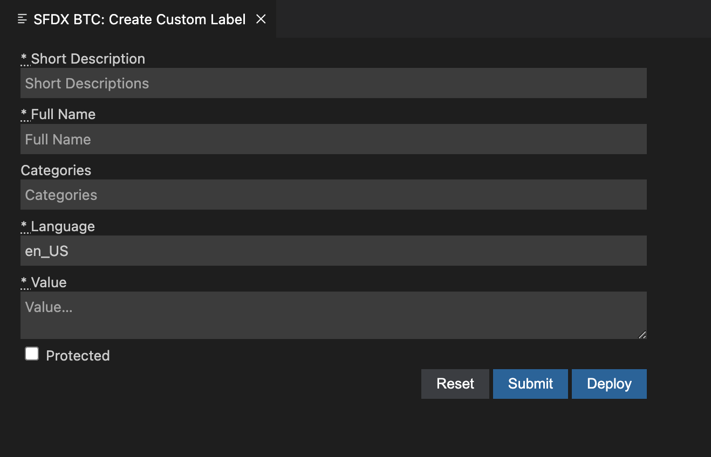
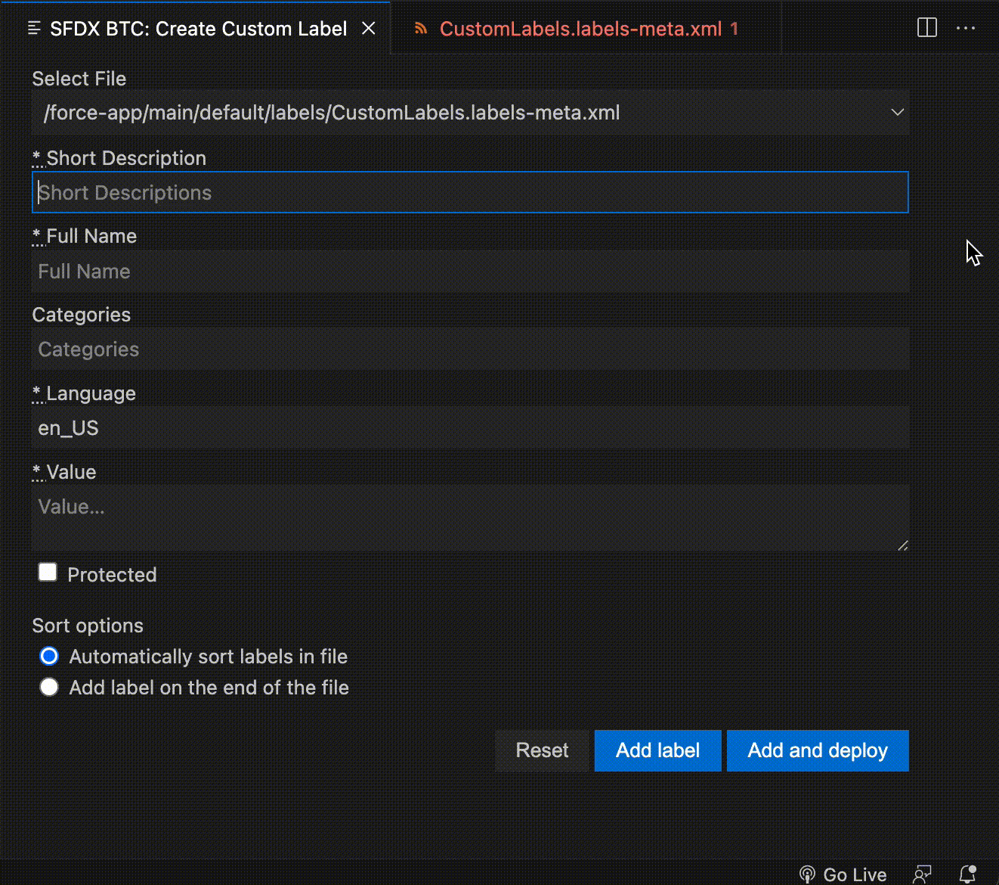

# Beyond The Cloud Labels Extension for Visual Studio Code

This extension allows you to easily add and sort Custom Labels from Salesforce in your Visual Studio Code.

## Documentation

Run command `SFDX BTC: Create Custom Label` to run extension.

Extension has to be run in project which contains at least one file with labels-meta.xml extension.

## Features

- If more than one files which name ends with labels-meta.xml are detected, you'll see additional select input on the top.
- You can select sort options: your new custom label can be added to your Custom Label file in alphabetical order or on the end of the file.
- Click `Add label` to add the custom label to selected file.
- Click `Add and deploy` to add the custom label to selected file and to deploy that custom label to environment which you are authenticated to.
