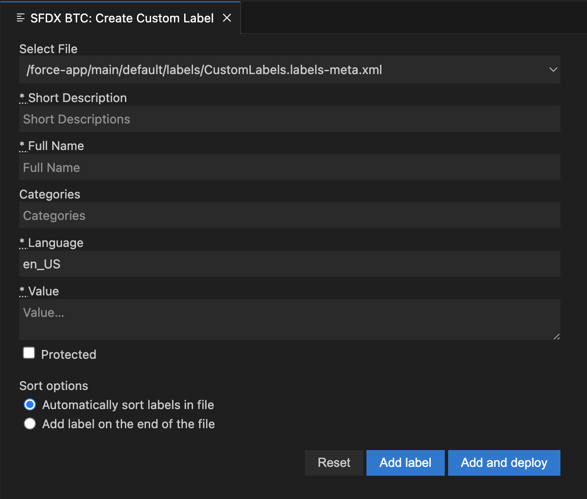

# Beyond The Cloud Labels Extension for Visual Studio Code

This extension allows you to easily add and sort Custom Labels from Salesforce in your Visual Studio Code.

## Documentation

Run command `SFDX BTC: Create Custom Label` to run extension.

Extension has to be run in project which contains at least one CustomLabels.labels-meta.xml file.
If more than one files named CustomLabels.labels-meta.xml are detected, you'll see additional select input on the top.

While using the extension - custom labels will be automatically sorted in your file.
